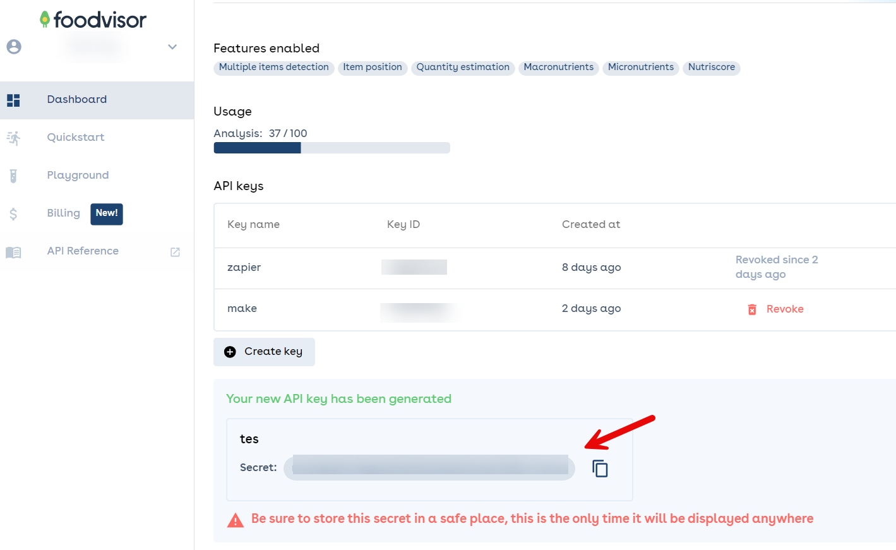

# Carb Counter App for iOS

## Wstęp
Stworzymy prostą aplikację na iPhone, która pomoże w oszacowaniu ilości węglowodanów w posiłku na podstawie zdjęcia. Aplikacja opiera się na darmowych narzędziach, takich jak Foodvisor.io oraz Make.com.

## Kroki

### 1. Rejestracja i pozyskanie klucza API w Foodvisor.io
W tym celu użyjemy rozwiązania Foodvisor.io, które analizuje zdjęcia i dostarcza informacji o ilości węglowodanów. Możesz sprawdzić, jak to działa, korzystając z darmowego demo: [https://www.foodvisor.io/en/vision/#demo](https://www.foodvisor.io/en/vision/#demo).

1. Zarejestruj się na [Foodvisor.io](https://www.foodvisor.io).
2. Przejdź do zakładki `Dashboard`.
3. Utwórz nowy klucz API (`Create Key`), nadaj mu dowolną nazwę i kliknij `Validate`.
4. Skopiuj wygenerowany klucz API – będzie widoczny tylko raz, więc zachowaj go w bezpiecznym miejscu.
   

## 2. Tworzenie scenariusza automatyzacji w Make.com

Make.com pozwala na automatyzację zadań w prosty, wizualny sposób.

1. Załóż konto na [Make.com](https://www.make.com) i zaloguj się.
2. Pobierz plan scenariusza (blueprint): [carb_counter_blueprint_make.json](./carb_counter_blueprint_make.json).
3. Po zalogowaniu kliknij `+ create scenario`.
4. W dolnym rogu strony znajdź przycisk z trzema kropkami i wybierz opcję `Import blueprint`.

   

5. Wskaż plik `carb_counter_blueprint_make.json`, aby zaimportować gotowy scenariusz.
6. Na końcu kliknij `Save`. Scenariusz powinien zostać zaimportowany jak na grafice poniżej:

   

## 3. Konfiguracja scenariusza w Make.com

1. Kliknij pierwszy element o nazwie `Webhooks - Custom Webhook`.
2. Kliknij `Create a webhook` i nadaj mu dowolną nazwę, następnie zapisz (`save`).

   Powinien pojawić się link jak na grafice poniżej, zaczynający się od `https://hook.eu2.make.com/(..)`:

   

3. Skopiuj wygenerowany link webhooka do notatnika – przyda się później.
4. Kliknij na drugi element scenariusza, czyli `HTTP - Make a request`.
5. W polu `Api-Key <token>`, zamień `<token>` na klucz API wygenerowany w Foodvisor.io.

   

6. Po zakończeniu konfiguracji kliknij `Save`, aby zapisać scenariusz.

### 4. Ustawienia aktywacji scenariusza

1. Aby scenariusz działał na bieżąco, w lewym dolnym rogu włącz opcję `ON`.
2. Wybierz opcję `Immediately as data arrives`.

   

## 5. Dodanie skrótu iOS

1. Pobierz skrót `Carb Counter` [tutaj](https://www.icloud.com/shortcuts/69af5b591382461c8b0f4e2d6ffbe229).
   
2. Po wczytaniu, kliknij na dole `+ Dodaj skrót`.

3. Po dodaniu skrótu, kliknij na kafelku `Carb Counter` trzy kropki w prawym rogu, aby go edytować.

   

4. Znajdź piąty kafelek zawierający "Pobierz zawartość paste/link/from/make.com" (PL).
5. Usuń fragment `paste/link/from/make.com`, a następnie wklej link webhooka skopiowany wcześniej z Make.com, zaczynający się od `https://hook.eu2.make.com/(..)`.
   
   

6. Aby dodać skrót do ekranu głównego, kliknij ikonę udostępniania i wybierz opcję `Do ekranu początkowego` (PL).

   

7. Jeśli chcesz, możesz zmienić nazwę, ikonę, kolor. Następnie kliknij `Dodaj`.

### 6. Gotowe!

Aplikacja jest gotowa do użycia. Kliknij ikonę na ekranie, wybierz zdjęcie, a po około 3 sekundach otrzymasz informację o ilości węglowodanów w posiłku.
